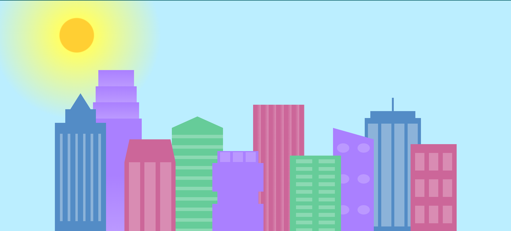

# City Skyline Project

This project showcases a simple city skyline created using HTML and CSS. It offers a visually appealing representation of buildings against a sky background. Each building is designed with different colors and patterns to add depth and variation to the skyline.

## Table of Contents

- [Demo](#demo)
- [Features](#features)
- [Installation](#installation)
- [Usage](#usage)
- [Customization](#customization)
- [Contributing](#contributing)
- [License](#license)

## Demo

You can view a live demo of the project [here](link-to-live-demo).

## Features

- Utilizes HTML and CSS for building the skyline.
- Provides a visually pleasing representation of city buildings against a sky background.
- Customizable colors and gradients for buildings and windows.
- Responsive design for different screen sizes.

## Installation

To run this project locally, follow these steps:

1. Clone this repository to your local machine using: git clone https://github.com/your-username/city-skyline.git

2. Navigate to the project directory: cd city-skyline

## Usage

To view the skyline, simply open the `index.html` file in your web browser. The skyline will be displayed with default settings.

## Customization

You can customize various aspects of the skyline by modifying the `styles.css` file. Here are some customization options:

- Adjust building colors by changing the `--building-colorX` variables in the `:root` selector.
- Modify window colors by changing the `--window-colorX` variables in the `:root` selector.
- Alter building shapes and sizes by adjusting the corresponding CSS classes (e.g., `.bb1`, `.fb2`).

For more detailed customization, refer to the comments in the `styles.css` file for each CSS class.

## Contributing

Contributions are welcome! If you have any suggestions, enhancements, or bug fixes, feel free to open an issue or create a pull request.

## License

This project is licensed under the [MIT License](LICENSE).
# Buildings-CSS-HTML
